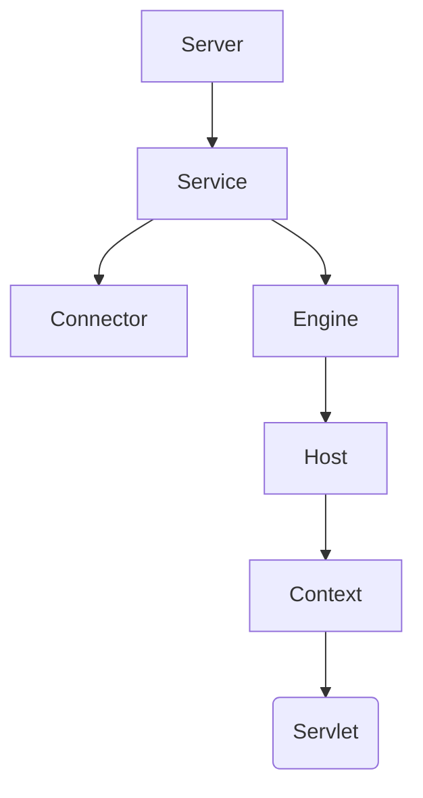

```markdown
# Tomcat 核心架构与原理

## 一、网络通信基础

### 1.1 Socket通信模型
```java
// Java原生Socket实现
ServerSocket server = new ServerSocket(8080);
Socket client = server.accept();
```

### 1.2 Tomcat协议实现
| 协议类型       | 实现类                  | 特点                     |
|----------------|-------------------------|--------------------------|
| BIO            | JIoEndpoint            | 阻塞式I/O                |
| NIO            | NioEndpoint            | 非阻塞I/O（Java实现）    |
| NIO2           | Nio2Endpoint           | 异步I/O                  |
| APR            | AprEndpoint            | 本地库实现               |

## 二、容器架构体系

### 2.1 核心组件层级


### 2.2 生命周期管理
```java
public interface Lifecycle {
    void init();
    void start();
    void stop();
    void destroy();
}
```

## 三、请求处理流程

### 3.1 完整处理链条
```
1. Acceptor接收TCP连接
2. Processor解析HTTP协议
3. Adapter转换ServletRequest
4. FilterChain执行过滤
5. Servlet.service()处理业务
6. Response写入OutputStream
```

### 3.2 FilterChain实现
```java
public final class ApplicationFilterChain implements FilterChain {
    private int pos = 0;
    private Servlet servlet;
    
    public void doFilter(ServletRequest request, ServletResponse response) {
        if (pos < filters.size()) {
            filters.get(pos++).doFilter(request, response, this);
        } else {
            servlet.service(request, response);
        }
    }
}
```

## 四、类加载体系

### 4.1 类加载器层次
```
Bootstrap
   ↑
System
   ↑
Common
   ├── Catalina (加载Tomcat内部类)
   └── Shared (共享类)
        ↑
   WebappX (每个Web应用独立)
```

### 4.2 加载优先级
1. WEB-INF/classes
2. WEB-INF/lib/*.jar
3. Shared类加载器
4. Common类加载器

## 五、核心配置解析

### 5.1 Server.xml配置
```xml
<Service name="Catalina">
    <Connector port="8080" protocol="HTTP/1.1"
               connectionTimeout="20000"
               redirectPort="8443" />
               
    <Engine name="Catalina" defaultHost="localhost">
        <Host name="localhost"  appBase="webapps"
              unpackWARs="true" autoDeploy="true">
        </Host>
    </Engine>
</Service>
```

### 5.2 Context配置
```xml
<Context docBase="myapp" 
         path="/myapp" 
         reloadable="true"
         crossContext="true">
    <WatchedResource>WEB-INF/web.xml</WatchedResource>
</Context>
```

## 六、性能调优指南

### 6.1 Connector优化参数
| 参数名          | 建议值 | 说明                          |
|-----------------|--------|-------------------------------|
| maxThreads      | 200-500| 最大工作线程数                |
| acceptCount     | 100    | 等待队列长度                  |
| connectionTimeout| 20000 | 连接超时时间(ms)             |
| maxConnections  | 10000  | 最大并发连接数                |

### 6.2 JVM参数优化
```bash
JAVA_OPTS="-server 
           -Xms1024m -Xmx2048m 
           -XX:+UseG1GC 
           -XX:+DisableExplicitGC
           -XX:+HeapDumpOnOutOfMemoryError"
```

## 七、监控与诊断

### 7.1 JMX监控配置
```properties
-Dcom.sun.management.jmxremote
-Dcom.sun.management.jmxremote.port=9010
-Dcom.sun.management.jmxremote.ssl=false
-Dcom.sun.management.jmxremote.authenticate=false
```

### 7.2 关键监控指标
| 指标类型        | 说明                      |
|-----------------|---------------------------|
| ThreadPool      | 线程池使用情况            |
| Session         | 会话数量和存活时间        |
| JVM Memory      | 堆内存使用情况            |
| RequestCount    | 请求处理统计              |

## 八、扩展机制

### 8.1 Valve拦截器
```java
public class CustomValve extends ValveBase {
    @Override
    public void invoke(Request request, Response response) {
        // 前置处理
        getNext().invoke(request, response);
        // 后置处理
    }
}
```

### 8.2 自定义类加载器
```java
public class HotDeployClassLoader extends WebappClassLoader {
    @Override
    public Class<?> findClass(String name) {
        // 实现热加载逻辑
    }
}
```

## 附：常用命令速查

| 命令                   | 作用                       |
|------------------------|----------------------------|
| catalina.sh configtest | 检查配置文件有效性         |
| catalina.sh run        | 前台启动                   |
| catalina.sh jpda start| 调试模式启动               |
| catalina.sh stop       | 优雅停机                   |

```