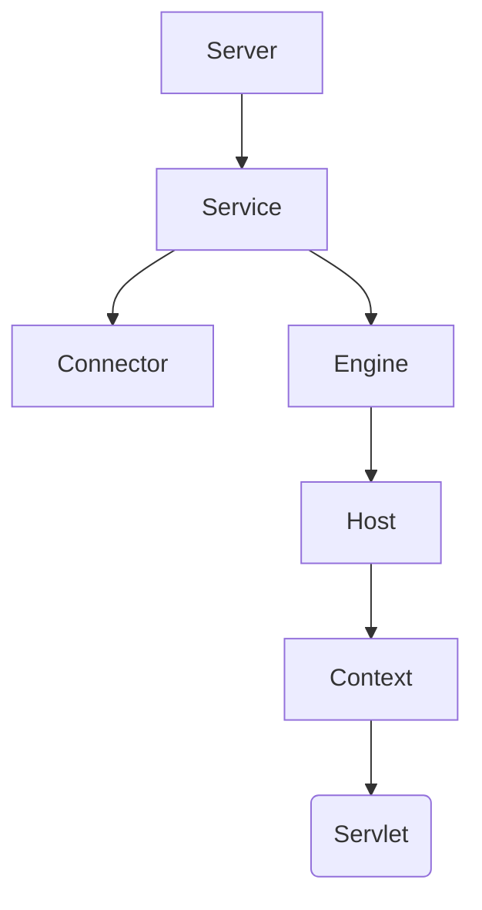

```markdown
# Tomcat 核心架构与原理

## 一、网络通信基础

### 1.1 Socket通信模型
```java
// Java原生Socket实现
ServerSocket server = new ServerSocket(8080);
Socket client = server.accept();
```

### 1.2 Tomcat协议实现
| 协议类型       | 实现类                  | 特点                     |
|----------------|-------------------------|--------------------------|
| BIO            | JIoEndpoint            | 阻塞式I/O                |
| NIO            | NioEndpoint            | 非阻塞I/O（Java实现）    |
| NIO2           | Nio2Endpoint           | 异步I/O                  |
| APR            | AprEndpoint            | 本地库实现               |

## 二、容器架构体系

### 2.1 核心组件层级


### 2.2 生命周期管理
```java
public interface Lifecycle {
    void init();
    void start();
    void stop();
    void destroy();
}
```

## 三、请求处理流程

### 3.1 完整处理链条
```
1. Acceptor接收TCP连接
2. Processor解析HTTP协议
3. Adapter转换ServletRequest
4. FilterChain执行过滤
5. Servlet.service()处理业务
6. Response写入OutputStream
```

### 3.2 FilterChain实现
```java
public final class ApplicationFilterChain implements FilterChain {
    private int pos = 0;
    private Servlet servlet;
    
    public void doFilter(ServletRequest request, ServletResponse response) {
        if (pos < filters.size()) {
            filters.get(pos++).doFilter(request, response, this);
        } else {
            servlet.service(request, response);
        }
    }
}
```

## 四、类加载体系

### 4.1 类加载器层次
```
Bootstrap
   ↑
System
   ↑
Common
   ├── Catalina (加载Tomcat内部类)
   └── Shared (共享类)
        ↑
   WebappX (每个Web应用独立)
```

### 4.2 加载优先级
1. WEB-INF/classes
2. WEB-INF/lib/*.jar
3. Shared类加载器
4. Common类加载器

## 五、核心配置解析

### 5.1 Server.xml配置
```xml
<Service name="Catalina">
    <Connector port="8080" protocol="HTTP/1.1"
               connectionTimeout="20000"
               redirectPort="8443" />
               
    <Engine name="Catalina" defaultHost="localhost">
        <Host name="localhost"  appBase="webapps"
              unpackWARs="true" autoDeploy="true">
        </Host>
    </Engine>
</Service>
```

### 5.2 Context配置
```xml
<Context docBase="myapp" 
         path="/myapp" 
         reloadable="true"
         crossContext="true">
    <WatchedResource>WEB-INF/web.xml</WatchedResource>
</Context>
```

## 六、性能调优指南

### 6.1 Connector优化参数
| 参数名          | 建议值 | 说明                          |
|-----------------|--------|-------------------------------|
| maxThreads      | 200-500| 最大工作线程数                |
| acceptCount     | 100    | 等待队列长度                  |
| connectionTimeout| 20000 | 连接超时时间(ms)             |
| maxConnections  | 10000  | 最大并发连接数                |

### 6.2 JVM参数优化
```bash
JAVA_OPTS="-server 
           -Xms1024m -Xmx2048m 
           -XX:+UseG1GC 
           -XX:+DisableExplicitGC
           -XX:+HeapDumpOnOutOfMemoryError"
```

## 七、监控与诊断

### 7.1 JMX监控配置
```properties
-Dcom.sun.management.jmxremote
-Dcom.sun.management.jmxremote.port=9010
-Dcom.sun.management.jmxremote.ssl=false
-Dcom.sun.management.jmxremote.authenticate=false
```

### 7.2 关键监控指标
| 指标类型        | 说明                      |
|-----------------|---------------------------|
| ThreadPool      | 线程池使用情况            |
| Session         | 会话数量和存活时间        |
| JVM Memory      | 堆内存使用情况            |
| RequestCount    | 请求处理统计              |

## 八、扩展机制

### 8.1 Valve拦截器
```java
public class CustomValve extends ValveBase {
    @Override
    public void invoke(Request request, Response response) {
        // 前置处理
        getNext().invoke(request, response);
        // 后置处理
    }
}
```

### 8.2 自定义类加载器
```java
public class HotDeployClassLoader extends WebappClassLoader {
    @Override
    public Class<?> findClass(String name) {
        // 实现热加载逻辑
    }
}
```

## 附：常用命令速查

| 命令                   | 作用                       |
|------------------------|----------------------------|
| catalina.sh configtest | 检查配置文件有效性         |
| catalina.sh run        | 前台启动                   |
| catalina.sh jpda start| 调试模式启动               |
| catalina.sh stop       | 优雅停机                   |


以下是 Tomcat 常见面试题分类整理，涵盖核心原理、配置优化、架构设计等高频考点：

---

### **一、基础概念**
1. **Tomcat 是什么？和 Web 服务器（如 Nginx）的区别是什么？**  
   - 答案要点：Servlet 容器 vs 静态资源服务器；Tomcat 支持 JSP/Servlet 的动态处理能力。

2. **Tomcat 的核心组件有哪些？描述其层级关系。**  
   - 答案要点：`Server → Service → Connector + Engine → Host → Context → Wrapper`。

3. **解释 `server.xml` 中的常见配置项（如 Connector、Host、Context）。**

---

### **二、架构设计**
4. **Tomcat 的请求处理流程是怎样的？**  
   - 答案要点：从 `Acceptor` 接收请求 → `ProtocolHandler` 解析 → `Adapter` 转换 → `Container` 处理 → `FilterChain` → `Servlet`。

5. **Connector 和 Container 的作用分别是什么？**  
   - 答案要点：  
     - Connector：处理网络通信（协议解析、线程池管理）。  
     - Container：处理业务逻辑（Servlet 生命周期、请求路由）。

6. **Tomcat 支持的 I/O 模型有哪些？NIO 和 BIO 的区别？**  
   - 答案要点：BIO（阻塞式）、NIO（非阻塞）、NIO2（异步）、APR（本地库）；NIO 通过 Selector 实现多路复用。

---

### **三、类加载机制**
7. **Tomcat 的类加载器层次结构是怎样的？**  
   - 答案要点：  
     ```  
     Bootstrap → System → Common → WebappX（隔离每个应用）  
     ```

8. **为什么 Tomcat 需要打破双亲委派机制？**  
   - 答案要点：实现应用间类隔离，避免不同 Web 应用的类冲突（如不同版本的库）。

9. **如何实现 Web 应用的热部署？**  
   - 答案要点：通过自定义 `WebappClassLoader` 重新加载类，配合 `Context` 的 `reloadable` 配置。

---

### **四、配置与优化**
10. **如何优化 Tomcat 的线程池配置？**  
    - 答案要点：调整 `maxThreads`（最大线程数）、`acceptCount`（等待队列）、`minSpareThreads`（最小空闲线程）。

11. **Tomcat 内存溢出如何排查？**  
    - 答案要点：  
      1. 分析堆转储（`-XX:+HeapDumpOnOutOfMemoryError`）  
      2. 检查 `PermGen`（JDK8 前）或 `Metaspace`（JDK8+）  
      3. 排查内存泄漏（如未关闭的数据库连接、静态集合类）。

12. **如何配置 HTTPS？**  
    - 答案要点：使用 `SSL/TLS` 配置 Connector，通过 `keystore` 管理证书。

---

### **五、高级原理**
13. **Tomcat 如何实现 Session 管理？**  
    - 答案要点：  
      - 通过 `StandardManager` 持久化 Session 到磁盘  
      - 集群环境下使用 `DeltaManager` 或 `BackupManager` 同步 Session。

14. **解释 `Valve` 和 `Filter` 的区别。**  
    - 答案要点：  
      - Valve：Tomcat 容器级拦截，作用于所有请求（如访问日志）  
      - Filter：Servlet 规范中的拦截器，作用于特定 Web 应用。

15. **Tomcat 的启动过程是怎样的？**  
    - 答案要点：`Bootstrap` → `Catalina` → 加载 `server.xml` → 初始化 `Lifecycle` 组件 → 启动 Connector 和 Container。

---

### **六、实战场景**
16. **如何监控 Tomcat 的性能？**  
    - 答案要点：  
      - JMX 监控线程池、内存使用  
      - `AccessLogValve` 记录请求耗时  
      - 集成 Prometheus + Grafana。

17. **Tomcat 出现 404 的可能原因有哪些？**  
    - 答案要点：  
      - 应用未部署  
      - `web.xml` 配置错误  
      - Context 路径不匹配。

18. **如何实现 Tomcat 集群？**  
    - 答案要点：  
      1. 使用 Nginx 做负载均衡  
      2. 配置 Session 复制（如 `DeltaManager`）  
      3. 共享文件存储（如共享 `war` 包目录）。

---

### **七、源码与设计模式**
19. **Tomcat 中使用了哪些设计模式？**  
    - 答案要点：  
      - 责任链模式（FilterChain）  
      - 观察者模式（LifecycleListener）  
      - 工厂模式（ObjectFactory）。

20. **StandardWrapper 的作用是什么？**  
    - 答案要点：管理 Servlet 的生命周期（加载、初始化、销毁）。

---

### **八、与其他技术对比**
21. **Tomcat 与 Jetty 的区别？**  
    - 答案要点：  
      - Tomcat：功能全面，适合企业级应用  
      - Jetty：轻量级，嵌入式和云原生场景更优。

22. **Spring Boot 内嵌 Tomcat 的原理是什么？**  
    - 答案要点：通过 `TomcatServletWebServerFactory` 启动内嵌实例，直接调用 `Tomcat` API。

---

### **附：高频考点总结**
| 考点分类       | 高频问题                                                                 |
|----------------|--------------------------------------------------------------------------|
| 架构设计       | Connector 工作原理、请求处理流程、类加载机制                             |
| 性能优化       | 线程池参数、内存溢出排查、JVM 调优                                      |
| 配置管理       | HTTPS 配置、Context 配置、集群方案                                      |
| 设计模式       | Lifecycle 生命周期管理、责任链模式应用                                  |

建议结合以下实践加深理解：  
1. 通过 `catalina.sh configtest` 验证配置文件  
2. 使用 `jvisualvm` 监控 Tomcat 内存  
3. 阅读 `StandardEngine`、`StandardHost` 等核心类源码。